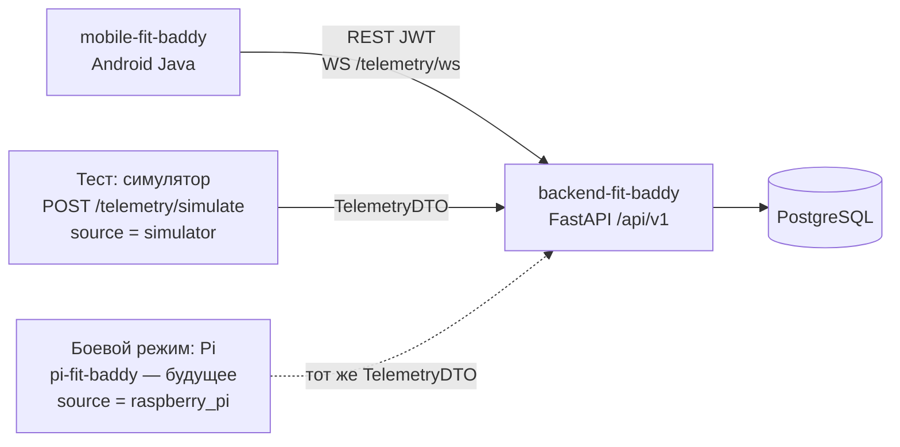
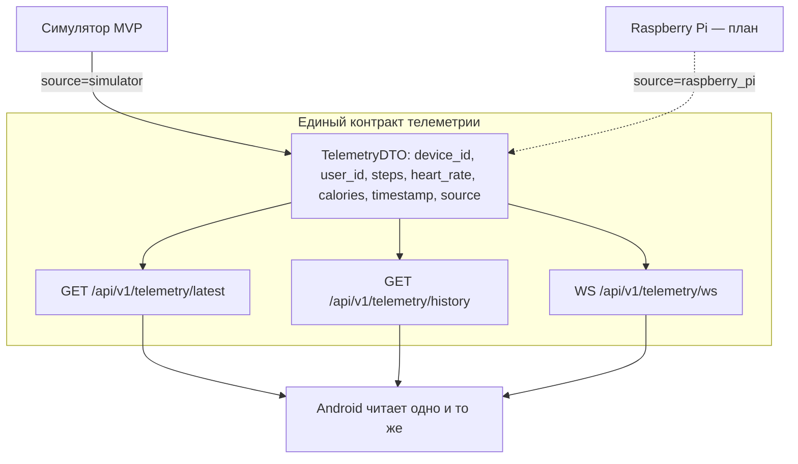
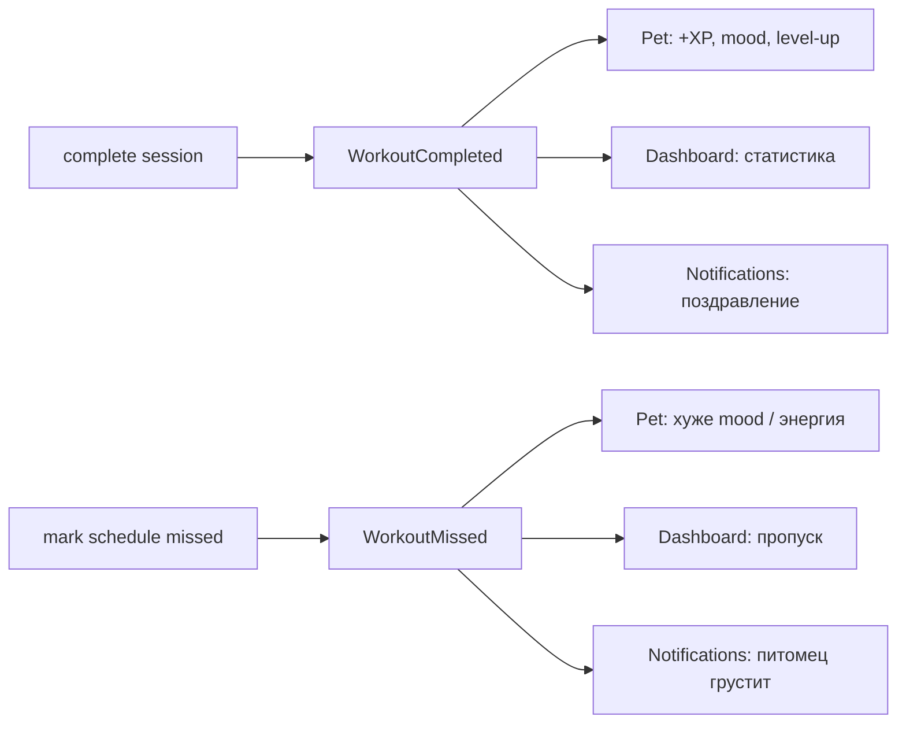

# Архитектура FitQuest

Учебный MVP: **модульный монолит** (FastAPI + PostgreSQL) и нативный Android-клиент. Не микросервисы, не брокер сообщений. Raspberry Pi в этом срезе **не реализован** — только запланирован.

## Три целевые папки

| Папка | Роль | Статус |
|---|---|---|
| `backend-fit-baddy/` | FastAPI-мост: REST `/api/v1`, WebSocket телеметрии, PostgreSQL, in-process события | текущий MVP |
| `mobile-fit-baddy/` | Нативное Android-приложение (Java). Основной клиент | текущий MVP |
| `pi-fit-baddy/` | Raspberry Pi: датчики пульса/шагов, публикация того же telemetry DTO | **будущее**, не в этом срезе |

Исторический каркас `backend/` + `frontend/` (React) остаётся в репозитории как черновик. **Основной клиент — Android.** React-заглушка не является целью демонстрации.

```
pi-fit-baddy/          ← будущее: I2C-датчики → тот же TelemetryDTO
backend-fit-baddy/     ← FastAPI + PostgreSQL (контракт /api/v1)
mobile-fit-baddy/      ← Android Java (JWT, REST, WS)
```

## Тестовая vs боевая телеметрия за одним контрактом

Клиент **не знает**, откуда пришли шаги и пульс. И симулятор, и будущий Pi отдают один DTO. Меняется только поле `source`.





Поток данных:

1. Источник (симулятор сейчас / Pi позже) публикует точку.
2. Backend сохраняет её и отдаёт по REST и WS.
3. Android рисует «последние известные» значения. Если WS недоступен — fallback на `GET /telemetry/latest` и статус «офлайн / последнее известное».

GPIO и I2C остаются внутри `pi-fit-baddy`. Выше уровня API специфики железа нет.

## Слои backend

Предпочтительный поток внутри `backend-fit-baddy`:

```
HTTP / WS router
    → Pydantic-схемы (контракт)
    → application service
    → repository
    → PostgreSQL
```

Роутер не содержит бизнес-логики. React-логика не дублируется на Android: игровые правила (XP, уровень, настроение) живут на сервере. Мобильное приложение отображает состояние и ведёт локальный таймер тренировки.

## Пять модулей команды и владельцы

Пять разработчиков, пять бизнес-модулей. Интеграция — через публичный API и in-process события, не через чужие репозитории.

| # | Модуль | Владение | Основные сущности | Публикует / потребляет |
|---|---|---|---|---|
| 1 | Аккаунт и расписание | регистрация, JWT, профиль, цели, календарь | User, Profile, Role, ScheduledWorkout | `WorkoutMissed` |
| 2 | Тренировки | планы, сессии, подходы, история | Exercise, WorkoutPlan, WorkoutSession, ExerciseSet | `WorkoutCompleted`, `WorkoutMissed` |
| 3 | Питомец и геймификация | XP, уровень, энергия, настроение, стрик | Pet, PetEvent, Quest, Achievement | потребляет `WorkoutCompleted`, `WorkoutMissed` |
| 4 | Дашборд и уведомления | сводка недели, история, центр уведомлений | Notification, ActivityStatistic | потребляет `WorkoutCompleted`, `WorkoutMissed` |
| 5 | ИИ + симулятор + подписка | mock-рекомендации, телеметрия, Free/Pro | DeviceConnection, Telemetry, AiRecommendation, Subscription, Payment | mock checkout / webhook; телеметрия по общему DTO |

Модуль 5 **не** привязан к модулю тренировок: симулятор ходит в `/api/v1/telemetry/*` и `/devices/register`, а не в таблицы сессий.

## In-process события

Для MVP достаточно **процессной шины внутри FastAPI** (подписки в том же процессе). Kafka / RabbitMQ не используются.

События текущего среза:

| Событие | Когда | Полезные поля |
|---|---|---|
| `WorkoutCompleted` | `POST /api/v1/workouts/sessions/{id}/complete` | `user_id`, `session_id`, `completed_at`, `duration_seconds` |
| `WorkoutMissed` | `POST /api/v1/schedule/{id}/miss` | `user_id`, `scheduled_id`, `missed_at` |



Обработчики вызываются синхронно в том же запросе (достаточно для демо). Модуль тренировок **не** импортирует модели питомца: только публикует событие.

## Клиент Android

`mobile-fit-baddy` — единственный основной UI:

- JWT Bearer на все защищённые методы;
- локальный таймер и чек-лист во время сессии (без тиканья на сервер каждую секунду);
- после «Завершить» — один `POST .../complete`;
- живые пульс/шаги — WS, при обрыве — REST latest + статус.

Эмулятор Android ходит на хост через `http://10.0.2.2:8000` (см. `docs/RUN.md`).

## Что сознательно не входит в архитектуру этого среза

- реализация `pi-fit-baddy` и реальное I2C;
- Stripe как обязательный платёжный провайдер (MVP — **mock checkout**);
- Kubernetes, очереди, CQRS, отдельный frontend как основной клиент.
