# Пользовательские истории FitQuest

Клиент — **Android (`mobile-fit-baddy`)**, сервер — **FastAPI (`backend-fit-baddy`)**. Raspberry Pi в историях не участвует: живые пульс и шаги в MVP даёт **симулятор** по тому же контракту.

После каждого шага указано, где он выполняется: `(mobile)`, `(backend)` или `(mobile → backend)`.

Контракт методов: `docs/API_CONTRACT.md`.

---

## Сквозной пользовательский поток

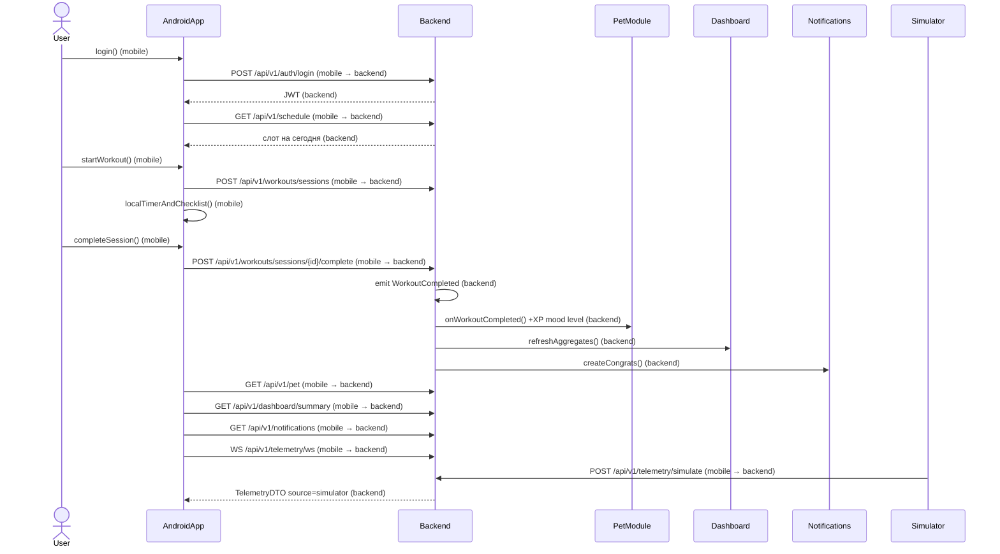

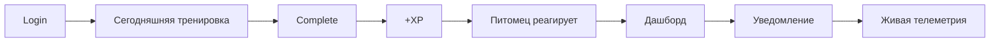

---

## 1. Регистрация и цель

**Как** новый пользователь,  
**я хочу** создать аккаунт и указать фитнес-цель,  
**чтобы** начать тренироваться с игровым питомцем.

Порядок вызовов:

1. `openRegisterScreen()` (mobile)
2. `submitRegisterForm(email, password, display_name)` (mobile)
3. `POST /api/v1/auth/register` (mobile → backend)
4. `createUser()` + `hashPassword()` (backend)
5. `createDefaultPet()` (backend)
6. `saveTokens()` (mobile)
7. `openGoalScreen()` (mobile)
8. `PATCH /api/v1/profile` (mobile → backend)
9. `updateProfile(goal, …)` (backend)
10. `GET /api/v1/auth/me` (mobile → backend) — подтверждение цели на экране

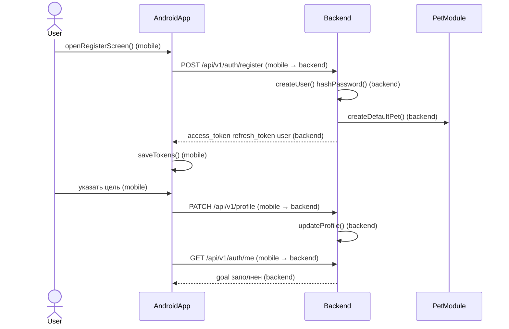

---

## 2. Вход и тренировка на сегодня

**Как** зарегистрированный пользователь,  
**я хочу** зайти в приложение и сразу увидеть план на сегодня,  
**чтобы** быстрее приступить к тренировке.

Порядок вызовов:

1. `openLoginScreen()` (mobile)
2. `POST /api/v1/auth/login` (mobile → backend)
3. `saveTokens()` (mobile)
4. `GET /api/v1/auth/me` (mobile → backend)
5. `GET /api/v1/schedule?from=&to=` (mobile → backend) — слоты на сегодня
6. `GET /api/v1/workouts/plans` (mobile → backend) — если у слота есть `plan_id`
7. `renderTodayWorkout()` (mobile)

Если слотов нет — пустой экран «На сегодня ничего не запланировано».

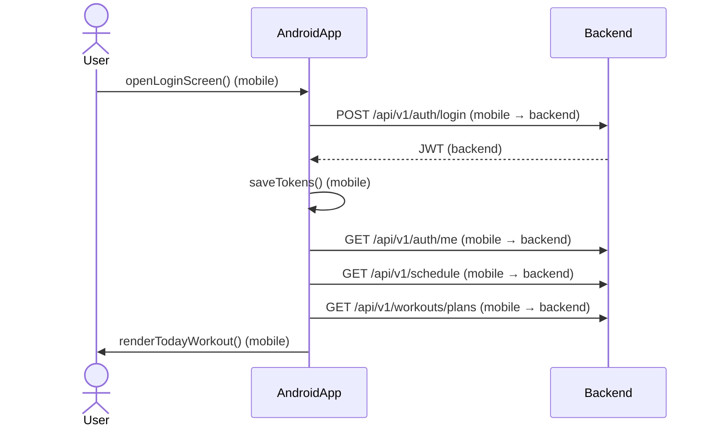

---

## 3. Создание плана и запись в календарь

**Как** пользователь,    
**я хочу** собрать программу (упражнения, подходы, повторы, вес) и поставить её в расписание,     
**чтобы** иметь четкий план тренировки.    

Порядок вызовов:

1. `openPlanEditor()` (mobile)
2. `POST /api/v1/workouts/plans` (mobile → backend)
3. `createPlanWithExercises()` (backend)
4. `openCalendar()` (mobile)
5. `POST /api/v1/schedule` (mobile → backend) — `plan_id` + `starts_at`
6. `createScheduleItem()` (backend)
7. `GET /api/v1/schedule` (mobile → backend)
8. `refreshCalendar()` (mobile)

Правка/удаление слота: `PATCH /api/v1/schedule/{id}` / `DELETE /api/v1/schedule/{id}` (mobile → backend).

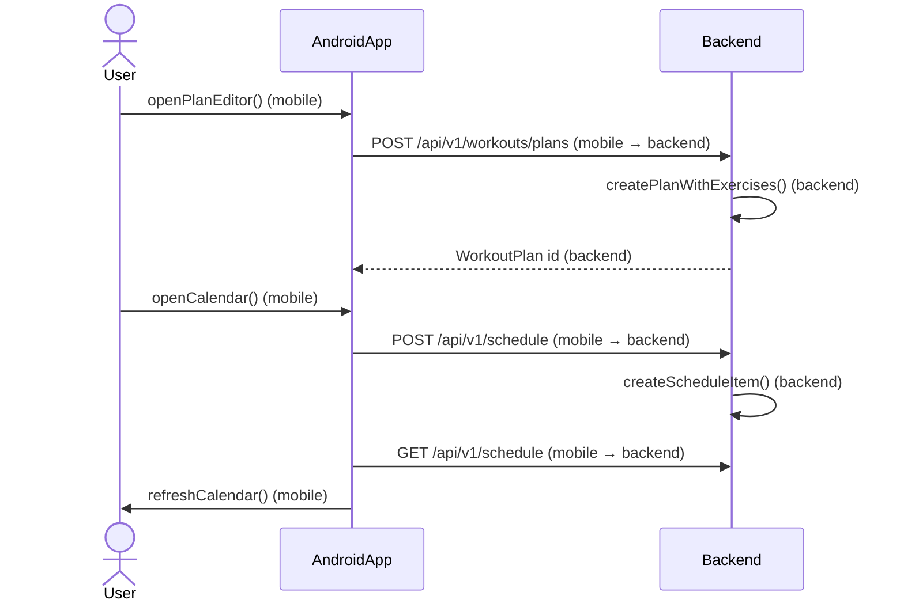

---

## 4. Выполнение тренировки: чек-лист и таймер

**Как** пользователь,  
**я хочу** начинать тренировку, отмечать упражнения и видеть таймер отдыха,  
**чтобы** контролировать процесс тренировки.

Таймер **локальный** на телефоне: сервер не тикает каждую секунду.

Порядок вызовов:

1. `openTodayWorkout()` (mobile)
2. `POST /api/v1/workouts/sessions` (mobile → backend) — `plan_id`, опционально `scheduled_id`
3. `createSession(status=in_progress)` (backend)
4. `startLocalTimer()` (mobile)
5. `toggleExerciseChecked()` (mobile) — чек-лист в памяти Activity
6. `startRestTimer(rest_seconds)` (mobile)
7. `pauseLocalTimer()` / `resumeLocalTimer()` (mobile)

До complete на backend уходит только факт старта сессии.

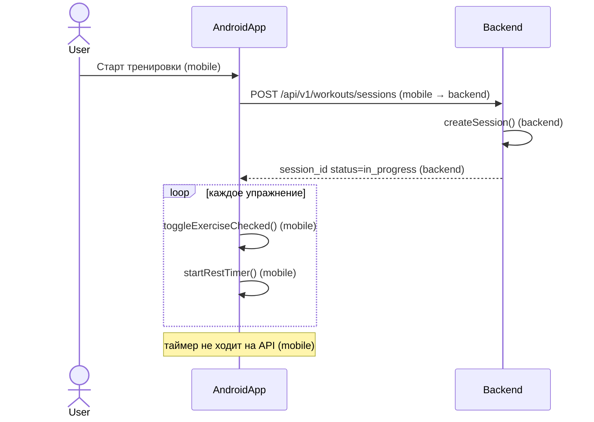

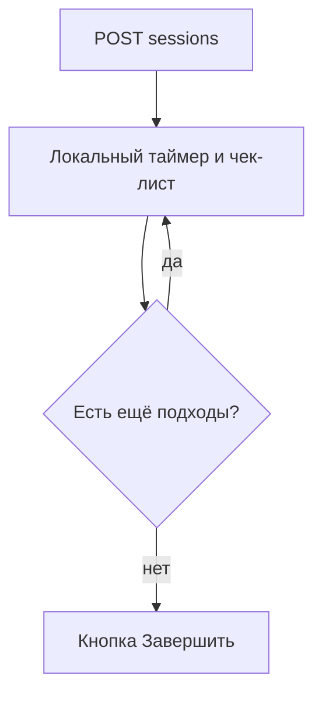

---

## 5. Завершение тренировки → реакция питомца

**Как** пользователь, закончивший подход,  
**я хочу** нажать «Завершить» и увидеть, что питомец получил XP и стал веселее / вырос уровень,    
**чтобы** мотивироваться на дальнейшую работу.    

Порядок вызовов:

1. `completeSession()` (mobile) — длительность с локального таймера
2. `POST /api/v1/workouts/sessions/{id}/complete` (mobile → backend)
3. `markSessionCompleted()` (backend)
4. `emit WorkoutCompleted` (backend)
5. `petOnWorkoutCompleted()` (backend) — XP, mood, level-up при пороге
6. `dashboardOnWorkoutCompleted()` (backend)
7. `notificationsOnWorkoutCompleted()` (backend)
8. `GET /api/v1/pet` (mobile → backend)
9. `renderPetReaction()` (mobile)

Игровые числа считает **backend**. Android только показывает ответ `GET /pet` и поле `xp_awarded` у complete.

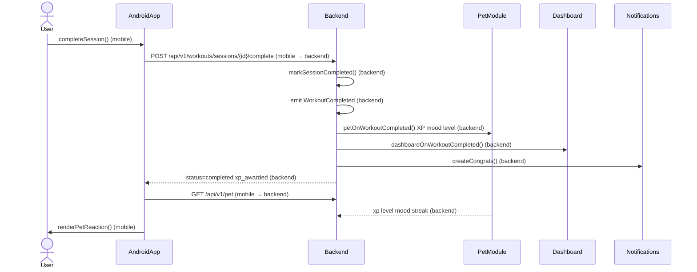

Пропуск слота (зеркальный путь, без complete):

1. `markMissed()` (mobile)
2. `POST /api/v1/schedule/{id}/miss` (mobile → backend)
3. `emit WorkoutMissed` (backend)
4. `petOnWorkoutMissed()` (backend) — хуже mood/энергия
5. `GET /api/v1/pet` (mobile → backend)

---

## 6. Просмотр XP, уровня, настроения и стрика

**Как** пользователь,  
**я хочу** открыть питомца и увидеть XP, уровень, настроение и серию дней,  
**чтобы** видеть свой прогресс.

Порядок вызовов:

1. `openPetScreen()` (mobile)
2. `GET /api/v1/pet` (mobile → backend)
3. `computeViewModel(xp, level, mood, streak_days)` (mobile) — только отображение
4. `GET /api/v1/dashboard/summary` (mobile → backend) — стрик дублируется в сводке для дашборда
5. `renderBarsAndMood()` (mobile)

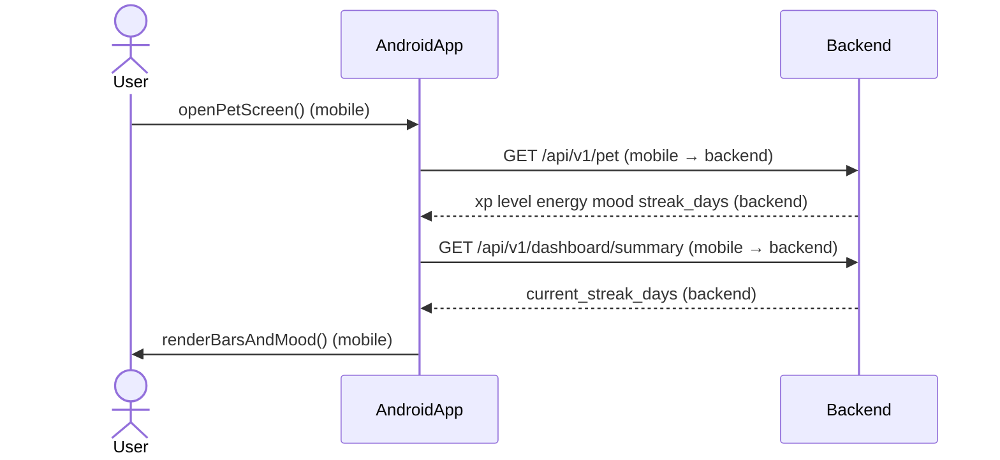

---

## 7. Живой пульс и шаги (симулятор)

**Как** пользователь,  
**я хочу** видеть пульс и шаги с "умных часов",  
**чтобы** чтобы видеть всю свою активность в одном месте.

Источник MVP: симулятор, `source=simulator`. Боевой Pi (`source=raspberry_pi`) — тот же DTO, позже.

Порядок вызовов:

1. `openLiveStatsScreen()` (mobile)
2. `POST /api/v1/devices/register` (mobile → backend) — один раз, `kind=simulator`
3. `connectTelemetryWs()` (mobile)
4. `WS /api/v1/telemetry/ws` (mobile → backend)
5. `POST /api/v1/telemetry/simulate` (mobile → backend) — кнопка «сгенерировать» или автотик на клиенте
6. `storeTelemetryPoint()` (backend)
7. `broadcastWs(TelemetryDTO)` (backend)
8. `renderHeartRateAndSteps()` (mobile)

Альтернатива без WS: периодический `GET /api/v1/telemetry/latest` (mobile → backend).

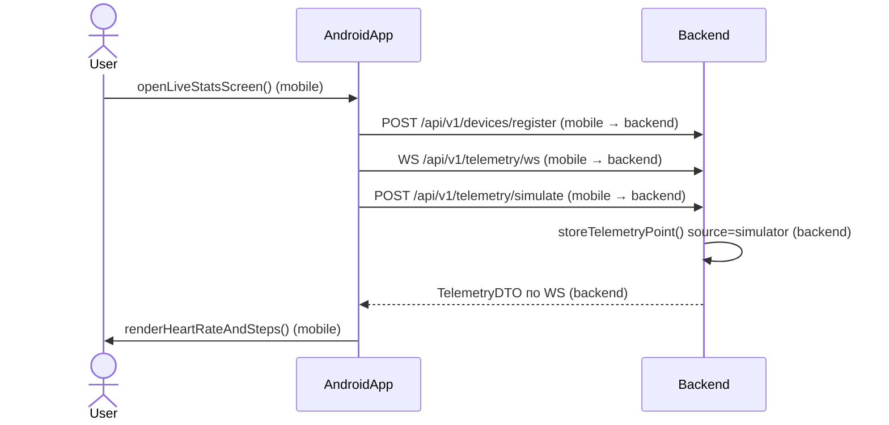

---

## 8. Недельный дашборд и история

**Как** пользователь,  
**я хочу** видеть сводку за неделю и список прошлых тренировок,  
**чтобы** оценивать свой текущий прогресс.

Порядок вызовов:

1. `openDashboard()` (mobile)
2. `GET /api/v1/dashboard/summary?period=week` (mobile → backend)
3. `aggregateWeek()` (backend) — не сырые копии сессий в UI-логике
4. `GET /api/v1/workouts/history` (mobile → backend)
5. `GET /api/v1/telemetry/history` (mobile → backend) — опционально шаги за период
6. `renderChartsAndList()` (mobile)

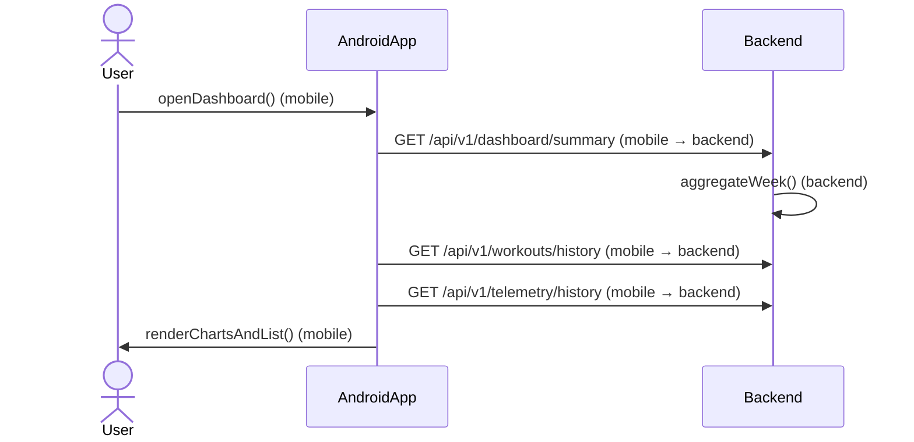

---

## 9. Уведомления

**Как** пользователь,  
**я хочу** видеть ленту напоминаний и реакций системы (тренировка засчитана, питомец грустит),  
**чтобы** не пропускать тренировки и иметь обратную связь.

Напоминания создаёт backend (по расписанию или при событиях). Push OS в MVP не обязателен: достаточно центра уведомлений в приложении.

Порядок вызовов:

1. `openNotificationCenter()` (mobile)
2. `GET /api/v1/notifications` (mobile → backend)
3. `listNotifications()` (backend)
4. `showList()` (mobile)
5. `markRead(id)` (mobile)
6. `POST /api/v1/notifications/{id}/read` (mobile → backend)
7. `setReadFlag()` (backend)

Создание после complete/miss — внутри обработчиков событий (backend), не отдельный вызов с телефона.

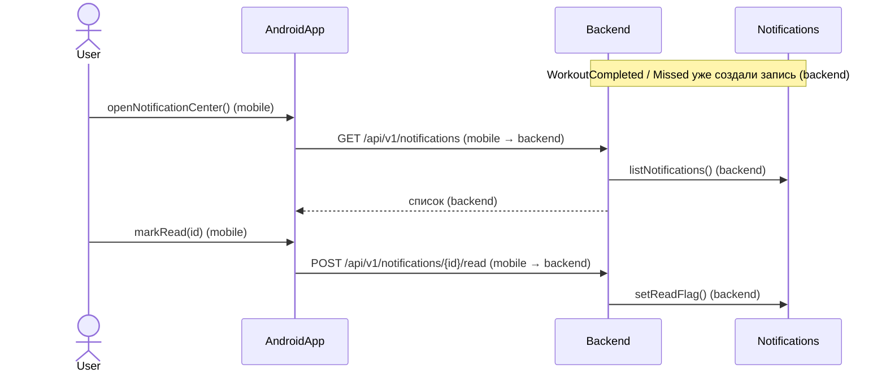

---

## 10. ИИ-рекомендация

**Как** пользователь,  
**я хочу** получать короткую рекомендацию по текущему прогрессу,  
**чтобы** качественно планировать будущий проресс.

Это **не** медицинский совет. На MVP — mock или простое правило. Может требовать Pro (`403`).

Порядок вызовов:

1. `openAiScreen()` (mobile)
2. `GET /api/v1/subscription` (mobile → backend) — есть ли entitlement
3. `checkEntitlement(ai_recommendations)` (backend)
4. `GET /api/v1/ai/recommend` (mobile → backend)
5. `buildRecommendation()` (backend) — mock / модель
6. `GET /api/v1/ai/history` (mobile → backend)
7. `showDisclaimerAndText()` (mobile)

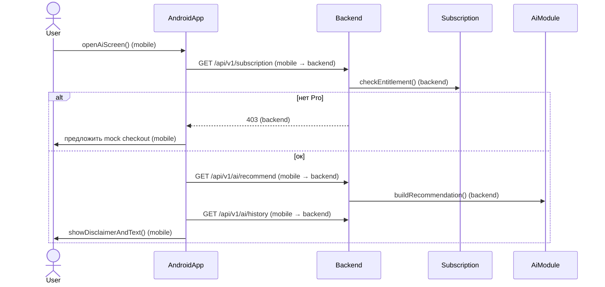

---

## 11. Mock-оформление Pro

**Как** пользователь,  
**я хочу** оформить подписку Pro,  
**чтобы** иметь доступ к премиальным функциям.

Порядок вызовов:

1. `openSubscriptionScreen()` (mobile)
2. `GET /api/v1/subscription` (mobile → backend)
3. `POST /api/v1/subscription/checkout` (mobile → backend) — `{ "plan": "pro" }`
4. `createMockCheckout()` (backend)
5. `showMockPaymentSheet()` (mobile) — «Оплатить (демо)»
6. `POST /api/v1/subscription/webhook` (mobile → backend) или серверный mock-вызов с `event_id`
7. `applyPlanIdempotent()` (backend)
8. `GET /api/v1/subscription` (mobile → backend)
9. `unlockProUi()` (mobile)

Повтор webhook с тем же `event_id` не должен дважды менять период.

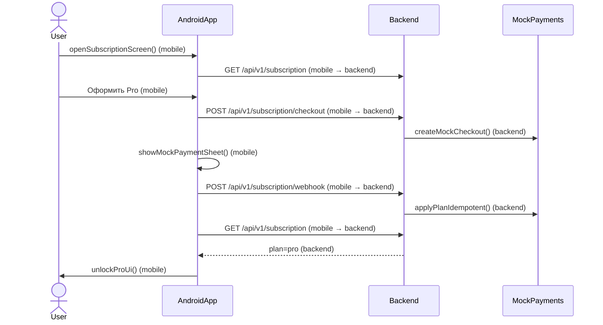

---

## 12. Офлайн / обрыв WS: последнее известное + статус

**Как** пользователь с нестабильной сетью,  
**я хочу** видеть последние шаги/пульс и понятный статус,  
**чтобы** экран не был пустым при плохом подключении.

Порядок вызовов:

1. `connectTelemetryWs()` (mobile)
2. `WS /api/v1/telemetry/ws` (mobile → backend)
3. при ошибке: `onWsDisconnected()` (mobile)
4. `GET /api/v1/telemetry/latest` (mobile → backend)
5. `getLastStoredPoint()` (backend)
6. `cacheTelemetryLocally()` (mobile) — SharedPreferences / Room, последний DTO
7. если и REST недоступен: `readLocalCache()` (mobile)
8. `showStatus("онлайн" | "офлайн, последнее известное")` (mobile)

Железо Pi здесь не требуется: тот же fallback сработает и для будущих точек `source=raspberry_pi`.

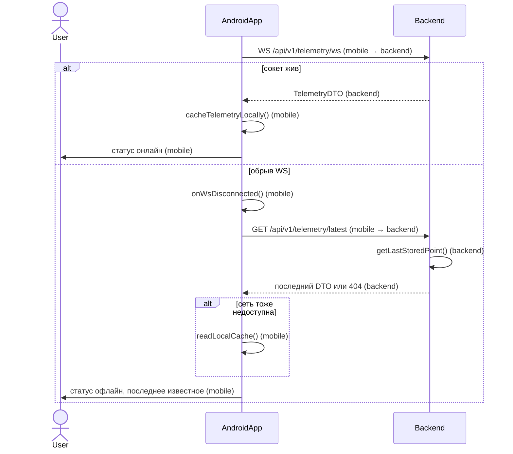

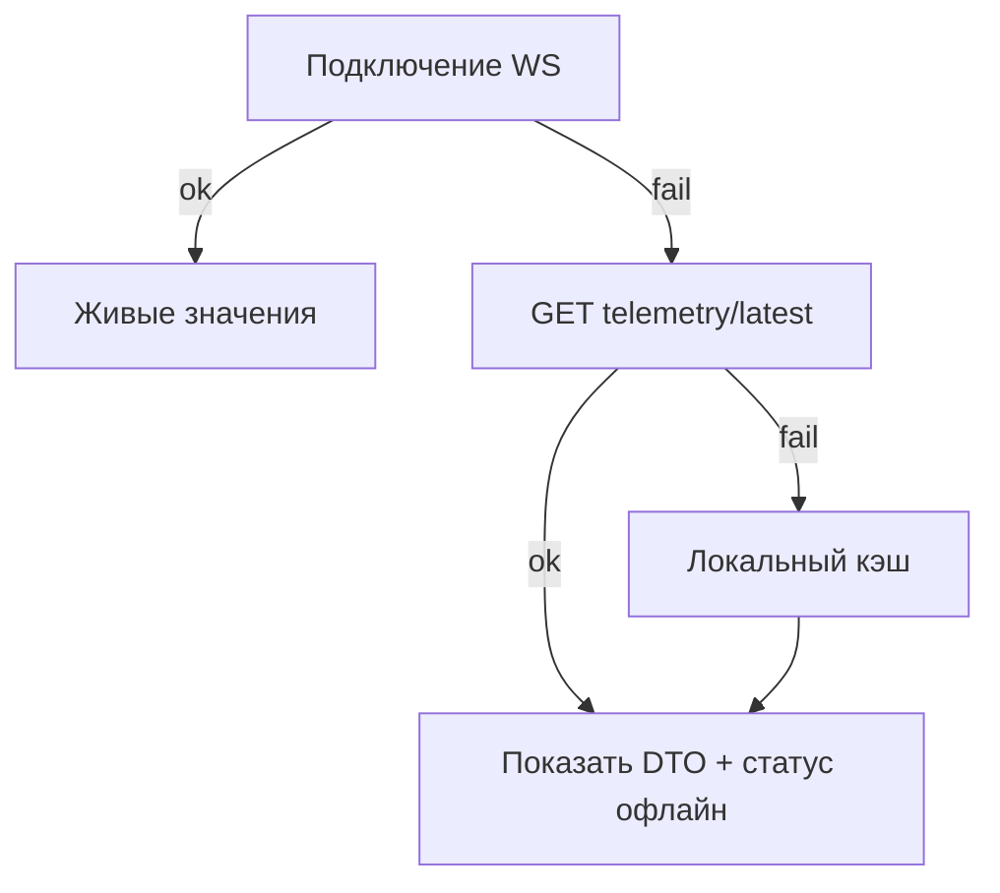

